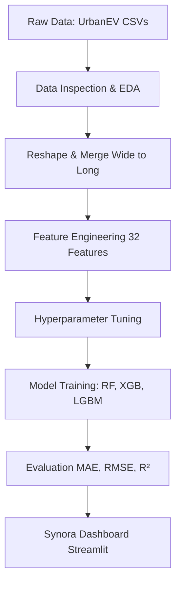

# Synora: Intelligent EV Charging Demand Prediction & Agentic Infrastructure Planning

## From Usage Analytics to Autonomous Grid & Station Planning

### Project Overview
This project focuses on building an **AI-driven analytics system** for electric vehicle (EV) charging demand prediction using the **UrbanEV dataset** from Shenzhen, China.

---

### System Architecture



---

### Technology Stack
| Component | Technology |
| :--- | :--- |
| **ML Models** | Random Forest, XGBoost, LightGBM, Scikit-Learn |
| **UI Framework** | Streamlit |
| **Visualization** | Plotly, Matplotlib, Seaborn |

---

### Dataset
The **UrbanEV** dataset (Li et al., 2025, *Scientific Data*) was collected from public EV charging stations in Shenzhen, China — a leading city in vehicle electrification. It covers a six-month period (September 1, 2022 – February 28, 2023).

| Property | Value |
| :--- | :--- |
| **Time Range** | Sep 2022 – Feb 2023 (6 months) |
| **Temporal Resolution** | Hourly |
| **Spatial Units** | 275 Traffic Analysis Zones (TAZs) |
| **Charging Stations** | 1,362 stations, 17,532 piles |
| **Raw Variables** | Occupancy, Volume, Duration, Electricity Price, Service Price |
| **Spatial Features** | Zone area, perimeter, coordinates, station counts |

**Data files used:**

| File | Description |
| :--- | :--- |
| `occupancy.csv` | Station utilization rate per zone per hour (%) |
| `volume.csv` | Total energy dispensed per zone per hour (kWh) |
| `duration.csv` | Aggregated charging duration per zone per hour |
| `e_price.csv` | Electricity price per kWh (CNY) |
| `s_price.csv` | Service fee per kWh (CNY) |
| `zone-information.csv` | Zone centroid coordinates, area, perimeter, pile counts |
| `station_information.csv` | Station-level coordinates and pile counts |

---

### Input–Output Specification

| | Description |
| :--- | :--- |
| **Input** | Hourly CSV data — occupancy, volume, duration, electricity & service prices, zone spatial features (coordinates, area, perimeter, station/pile counts) |
| **Engineered Features** | 32 features — temporal (hour, day, month, weekend), cyclical (sin/cos encoding), lag features (1h–168h), rolling statistics (mean/std over 6h–24h windows), spatial (charge density), price (total price) |
| **Output** | Predicted occupancy (%) and volume (kWh) per zone per hour |
| **Evaluation Metrics** | MAE, RMSE, R², MAPE |

---

### Model Results

#### Occupancy Prediction

| Model | MAE | RMSE | R² | MAPE (%) |
| :--- | :--- | :--- | :--- | :--- |
| **Random Forest** | 0.0075 | 0.1910 | 0.9999 | 0.02 |
| **LightGBM** | 0.0553 | 0.1417 | 0.9999 | 0.37 |
| **XGBoost** | 0.1574 | 0.8994 | 0.9981 | 0.62 |

#### Volume Prediction

| Model | MAE | RMSE | R² | MAPE (%) |
| :--- | :--- | :--- | :--- | :--- |
| **LightGBM** | 43.84 | 170.66 | 0.9599 | 48.78 |
| **XGBoost** | 44.26 | 169.64 | 0.9604 | 45.87 |
| **Random Forest** | 46.31 | 181.38 | 0.9547 | 43.89 |

> All three models achieve **R² > 0.95** on both targets, with Random Forest achieving near-perfect occupancy prediction (R² = 0.9999).

---

### Notebook Pipeline

| # | Notebook | Description |
| :--- | :--- | :--- |
| 1 | `01 data_inspection.ipynb` | Exploratory data analysis — loads all 6 raw CSVs, summary statistics, 7 visualizations (daily trends, hourly profiles, day-of-week patterns, distributions, correlation heatmap, zone-level analysis) |
| 2 | `02 reshape_dataset.ipynb` | Data reshaping & merging — melts all 5 hourly CSVs from wide to long format, merges with zone and station metadata into a single master DataFrame |
| 3 | `03 feature_engineering.ipynb` | Feature engineering — 32 features including temporal, cyclical (sin/cos), lag (1h–168h), rolling statistics, spatial (charge density), and price features |
| 4 | `04 hyperparameter_tuning.ipynb` | Hyperparameter tuning — GridSearchCV with TimeSeriesSplit for Random Forest, XGBoost, and LightGBM |
| 5 | `05 model_training.ipynb` | Model training & evaluation — dual-target (occupancy + volume), time-based split (Sep–Jan train, Feb test), 4 evaluation metrics |
| 6 | `06 visualization.ipynb` | Comprehensive evaluation — 19 charts including model comparison, actual vs predicted, residual analysis, feature importance, zone-level RMSE, price sensitivity |

---

### Dashboard

The **Synora** dashboard (`streamlit_app.py`) provides an interactive interface for exploring model predictions and performance.

**Pages:**
| Page | Description |
| :--- | :--- |
| **Overview** | KPI cards, R²/MAE bar charts, metrics table, hourly demand patterns, all-models overlay |
| **Model Comparison** | Model cards with metrics, grouped bar charts, metrics radar |
| **Predictions Explorer** | Time series, scatter plots, error distributions, residual analysis, data table |
| **Feature Importance** | Top-N feature bars, cross-model comparison (normalized %), full importance table |
| **Zone Analysis** | Interactive map (Shenzhen), MAE distribution, demand vs error scatter, zone rankings |
| **About** | Project overview, models used, tech stack, data pipeline description |

---

### Project Structure

```
EV_Demand_Project/
├── streamlit_app.py                    ← Streamlit dashboard (Synora)
├── requirements.txt                    ← Python dependencies
├── README.md                           ← This file
├── .streamlit/
│   └── config.toml                     ← Streamlit theme & server config
├── data/
│   ├── raw/
│   │   ├── charge_1hour/               ← Hourly charging data (6 CSVs)
│   │   ├── adj.csv                     ← Zone adjacency matrix
│   │   ├── distance.csv                ← Zone distance matrix
│   │   ├── station_information.csv     ← Station metadata
│   │   └── zone-information.csv        ← Zone spatial features
│   └── processed/
│       ├── merged_hourly_data.csv      ← All CSVs merged (from NB 02)
│       └── final_featured_dataset.csv  ← 32-feature dataset (from NB 03)
├── models/
│   ├── randomforest_occupancy.pkl      ← Trained Random Forest (occupancy)
│   ├── randomforest_volume.pkl         ← Trained Random Forest (volume)
│   ├── xgboost_occupancy.pkl           ← Trained XGBoost (occupancy)
│   ├── xgboost_volume.pkl              ← Trained XGBoost (volume)
│   ├── lightgbm_occupancy.pkl          ← Trained LightGBM (occupancy)
│   └── lightgbm_volume.pkl             ← Trained LightGBM (volume)
├── notebooks/
│   ├── 01 data_inspection.ipynb        ← EDA & visualizations
│   ├── 02 reshape_dataset.ipynb        ← Data reshaping & merging
│   ├── 03 feature_engineering.ipynb    ← Feature engineering pipeline
│   ├── 04 hyperparameter_tuning.ipynb  ← GridSearchCV tuning
│   ├── 05 model_training.ipynb         ← Model training & evaluation
│   └── 06 visualization.ipynb          ← Comprehensive chart suite
├── results/
│   ├── grid_search_results.csv         ← Tuning results
│   ├── best_hyperparameters.json       ← Optimal parameters
│   ├── metrics/
│   │   └── model_metrics.csv           ← MAE, RMSE, R², MAPE for all models
│   ├── predictions/
│   │   └── test_predictions.csv        ← Test set predictions
│   ├── feature_importance/             ← Per-model importance CSVs
│   └── charts/                         ← 19 exported evaluation charts
└── project_docs/
    ├── Project 15_AI_ML.pdf            ← Project brief
    ├── plan.md                         ← Execution plan
    └── project_sample.md               ← Reference sample
```

---

### Setup & Installation

```bash
# Clone the repository
git clone https://github.com/<username>/EV_Demand_Project.git
cd EV_Demand_Project

# Create virtual environment
python3 -m venv .venv
source .venv/bin/activate

# Install dependencies
pip install -r requirements.txt

# Run the dashboard
streamlit run streamlit_app.py
```

---

### Acknowledgements

- **Dataset:** *UrbanEV: An open benchmark dataset for urban electric vehicle charging demand prediction.* Scientific Data.
- **Location:** Shenzhen, China — 275 traffic analysis zones, Sep 2022 – Feb 2023.
